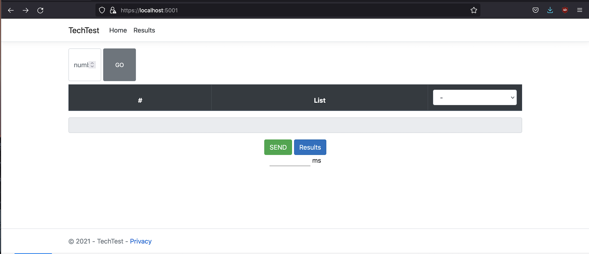

# TechTest

This website was made using asp.net core 5 mvc. (MAC OS)

The Dependencies:
  Razor RuntimeCompilation,
  EntityFrameworkCore Design,
  Sqlite,
  SqlServer,
  EntityFrameworkCore Tools,
  OpenApi, and
  CodeGeneration DesignAspNetCore
  
  This website sort the numbers that the user provides in either Ascending or Descending order.
  And in the results you will see all the data stored in the database and the user will be able to download a JSON file using Swagger UI.

